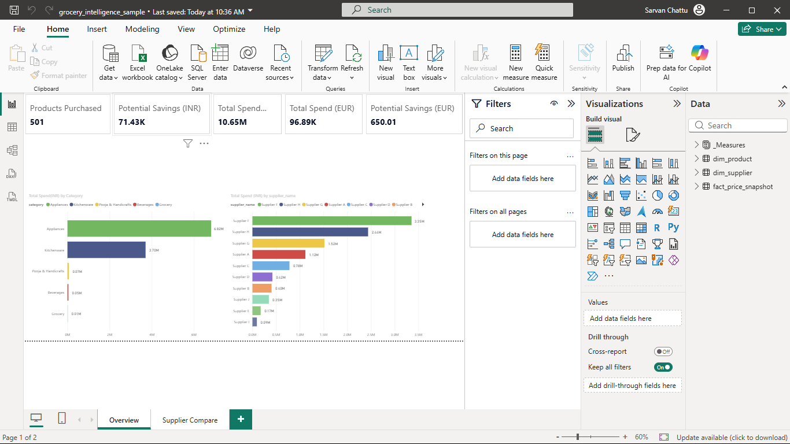
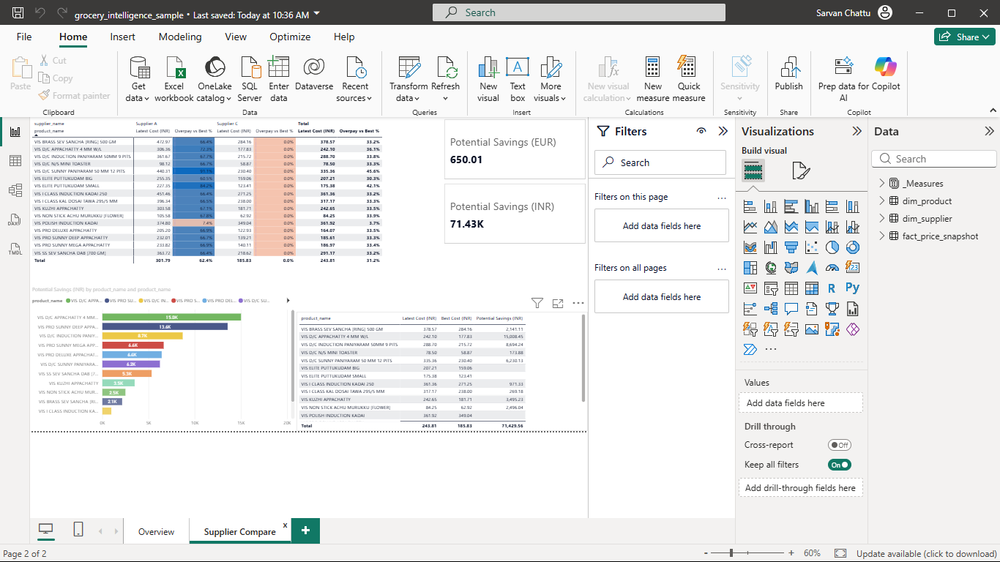

# 🛒 Grocery Intelligence — Purchasing Analytics for a Paris Specialty Grocery

End-to-end purchasing-analytics pipeline built on **real supplier invoice data**
from a Tamil/Indian specialty grocery store in Paris: Python ETL → validated
star schema → Power BI dashboard that reveals where the money goes, compares
suppliers on identical products, and prices the gap.

> **Headline result:** the analysis revealed that by spend, the store is an
> appliance & cookware importer (99% of import spend) — its signature pooja
> range is 0.6% of spend — and found 33–72% price gaps between suppliers on
> identical products, worth ≈0.7% of total spend at current volumes.
> **Decision taken by the store:** _pending — presentation scheduled with the
> owner (playbook in `docs/06_owner_presentation.md`)._



---

## The problem

A small grocery store imports ~500 products from 10 suppliers across dozens of
invoices per year. Prices change invoice to invoice, pack sizes differ between
suppliers, and ordering decisions were made from memory. Three questions
nobody could answer with numbers:

1. **Where does the money actually go** — by category, by supplier?
2. **Which supplier should we order each product from?**
3. **How much is being left on the table** by not comparing prices?

## The data

| Source | Content | Grain |
|---|---|---|
| Supplier invoices (photographed, manually extracted, validated) | 77 invoices · 501 products · 10 suppliers · Jun 2023 – May 2025 | 1 row = 1 product × supplier (latest-price snapshot) |
| ECB reference rate | INR → EUR conversion (flat rate, documented) | — |

**Privacy & anonymization.** This public repo contains an anonymized sample:
supplier names are replaced (Supplier A–J) and every monetary value is
perturbed by a hidden per-product factor (0.90–1.10). Because the factor is
**per product, not per row**, every ratio in the data — price gaps, overpay
percentages, "who is cheaper" — is preserved *exactly* while absolute prices
are fiction. The anonymization script is public (`etl/04_make_public_sample.py`);
its random seed is gitignored — method transparent, secret withheld. All
figures below are from the sample; magnitudes are representative, ratios are
exact.

## Architecture

```
Invoice photos ─► summary CSV ─► Python ETL ─► Star schema ─► Power BI
                  (514 rows)      cleaning,      fact_price_     2 pages,
                                  entity          snapshot       12 explicit
                                  resolution,     dim_product    DAX measures
                                  validation      dim_supplier
                                  gates, FX
```

**Star schema.** One fact table at product × supplier grain; product and
supplier dimensions carry all descriptive attributes; relationships are
many-to-one, single-direction, on surrogate keys. Aggregates ("latest price",
"total spend") are computed by measures, never stored.

```
 dim_supplier 1──* fact_price_snapshot *──1 dim_product
```

## Data quality engineering — the part that mattered most

The pipeline is defended by **input gates** (scripts refuse bad inputs and
print a fix-list), **source reconciliation** (output totals must match the
untouched source to the rupee on every run), and **independent verification**
(every DAX measure is checked against a pandas computation of the same logic
before it ships).

These defenses caught real incidents — kept in the history deliberately:

| Incident | How it was caught | Fix |
|---|---|---|
| Excel resave silently rewrote all dates to regional format | strict-then-fallback date parsing with loud failure | restore from Git + hardened parser |
| Bulk find-replace corrupted 4 raw join keys | input gate: "4 item names not found in master" | surgical repair script from source of truth (`etl/99_repair_item_names.py`) |
| Category fill-down swept 167 appliance products into the pooja category — inflating it to 47% of spend | spend-weighted label audit (top items per category eyeballed) | full recategorization; category whitelist added to the gate |
| A savings measure returned a plausible but wrong total | pre-computed pandas target didn't match | filter-context fix (iterate dimension keys, not fact rows) |

The category incident is the project's core lesson: **the initial dashboard
confidently reported that 47% of spend was pooja items; the audited truth is
0.6%.** Internally consistent ≠ correct — only item-level verification
against an independent target separates the two.

## Key findings (ratios exact; amounts from anonymized sample)

1. **The business is not what it looks like.** 64% of import spend is
   appliances, 35% cookware. The pooja & handicrafts range — the face of the
   shop — is 0.6% of spend. Two-thirds of all spend sits with just three
   suppliers.
2. **Identical products, very different prices.** 13 products were purchased
   from two suppliers each — gaps of 33–72% on identical items. Buying each
   from its cheaper supplier ≈ 0.7% of total spend recovered (≈ €650 at
   sample values).
3. **It's per-product, not per-supplier.** One product reverses the pattern —
   the otherwise-expensive supplier is cheaper on it. The defensible
   recommendation is per-product supplier choice plus a second quote before
   every reorder, not "switch suppliers".
   
   Method note: gap % is defined as (supplier price − best price for the product) ÷ best price, computed per product on the source data. Gaps recomputed from the public sample will differ from the published range: the anonymization preserves aggregate ratios (totals, counts, supplier shares) exactly, while individual prices — and therefore pair-level gaps — are intentionally perturbed for client confidentiality.

## The dashboard



| Page | Answers |
|---|---|
| **Overview** | Spend level, category split (with % of total in tooltips), supplier concentration |
| **Supplier Compare** | Product × supplier price matrix with overpay-vs-best % (conditional formatting), potential-savings cards, ranked leak chart |

Selected DAX (all measures explicit, housed in a dedicated table):
`Best Cost` uses `CALCULATE + MINX + ALL(dim_supplier)` to find the cheapest
supplier per product regardless of the visual's supplier filter;
`Overpay vs Best %` guards with `ISBLANK` so suppliers who don't sell a
product stay silent; `Potential Savings` iterates product×supplier pairs via
`SUMX(SUMMARIZE(...))` — dimension keys, not fact rows, so context transition
interacts correctly with `ALL()`.

## Honest limitations

- **Snapshot, not history.** The model sees each product's latest price, not
  its evolution — "who has been raising prices" needs line-level re-extraction
  of the 77 invoices (roadmap v2).
- **Import purchases only.** Local grocery/produce purchases are not in the
  data; category shares describe imports, not the whole shop.
- **Flat FX rate.** One documented EUR/INR rate; monthly rates are a v2 item.
- **Name variants undercount comparisons.** Case/spelling variants of the same
  product exist ("...KADAI" vs "...Kadai"); true cross-supplier overlap — and
  therefore savings — is likely higher than reported.

## Roadmap

- [ ] Line-level extraction of all 77 invoices → price history, price-change
      alerts, "who raised prices" analysis
- [ ] Case-folding + variant mapping in entity resolution
- [ ] Monthly FX rates
- [ ] `fact_sales` from the store's e-commerce backend → realized margin
- [ ] Demand forecasting with festival seasonality (Diwali, Pongal)

## How to run

```bash
git clone <repo-url>
cd grocery-intelligence
python -m venv .venv && .venv\Scripts\activate    # Windows
pip install -r requirements.txt

# the pipeline (sample data ships with the repo; raw data does not)
python etl/01_clean_summary.py        # cleaning + master drafts
python etl/02_build_star_schema.py    # gates, FX, star schema, reconciliation
python etl/04_make_public_sample.py   # anonymized sample (needs a local seed)
```

Open `powerbi/grocery_intelligence_sample.pbix` in Power BI Desktop (free) —
it reads `data/sample/`.

## Repo structure

```
etl/                  cleaning, star schema build, repair, anonymization
data/reference/       curated mapping tables (masters); raw source gitignored
data/sample/          anonymized, publishable dataset
powerbi/              sample .pbix (real-data .pbix gitignored)
docs/                 decision log, presentation playbook, screenshots
```

## Skills demonstrated

Python (pandas) ETL · entity resolution on messy multi-supplier data ·
validation gates & source-to-target reconciliation · dimensional modeling
(star schema, grain, surrogate keys) · Power Query (source shape, promoted
headers, typed columns) · DAX (filter context, CALCULATE/ALL, iterators,
context transition, explicit measures) · dashboard design for a non-technical
decision-maker · data anonymization with ratio preservation · Git-versioned,
incident-honest engineering history

## Author

**Sarvan Chattu** — M.Sc. Data Science & Analytics, EPITA Paris
<!-- TODO: LinkedIn URL · GitHub URL · email -->
